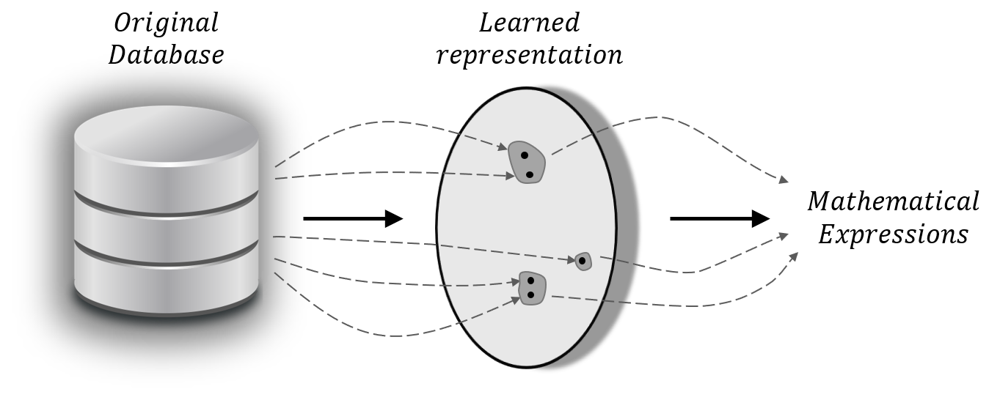

# OCCAM - Soft Decision Tree for Mathematical Expressions Mining

Pytorch implementation of the paper "Mining Mathematical Expressions From Proper Representations"


# How to run the code

## Install the Anaconda environment

```python
conda env create -f environment.yml
conda activate torch
```

## Datasets
- comma.ai: https://academictorrents.com/details/65a2fbc964078aff62076ff4e103f18b951c5ddb
* Groceries: https://www.kaggle.com/heeraldedhia/groceries-dataset

## Train CPC feature extractor for comma.ai
Change the parameters accordingly:
* data_path - path to the directory where the dataset is downloaded to
* epochs how many passes to perform on all the data
* num_workers - number of processes to use for loading and batching the data (doesn't affect the results)
* batch_size - the number of samples in each training batch
* device - the device number on which the training should be performed on, e.g. 1 for cuda:1
* window_stride - the sample interval for the sliding window
* timestep - size of the multi horizon window, e.g. 30 means predicting 30 timestamps
* window_length - the window length of each training sample
* exps_dir - target directory where all the models, preprocessed data and logging would be saved
* save_every - epoch interval in which a model checkpoint should be saved
* k - the number of neighbors 
```python
python run_cpc.py --data_path ../comma_ai_all_data/ --epochs 100 --num_workers 1 --batch_size 512 --device 1 --window_stride 200 --timestep 30 --window_length 2000 --exps_dir <dir> --k <k>
```

## Running the experiments
For an easy user experience, we implemented all the code in notebooks, which are very readable and organized. You may have to change the parameters in the notebook, which are self-explained.

The directory `notebooks` includes all the notebooks for this submission. You may choose the notebook corresponding to the desired experiment. For example, the notebook `comma_k_8_h_6.ipynb` related to the experiments with the comma.ai dataset, using the parameters `k=8` and `h=6`. Notice that in this case, you must firstly pre-train the `cpc` model as explained earlier and set the correct path inside the notebook for the parameter `model_dir`.  

Use the following command to open the notebooks interface while in the current anaconda environment:

```python
cd notebooks
jupyter notebook
```
